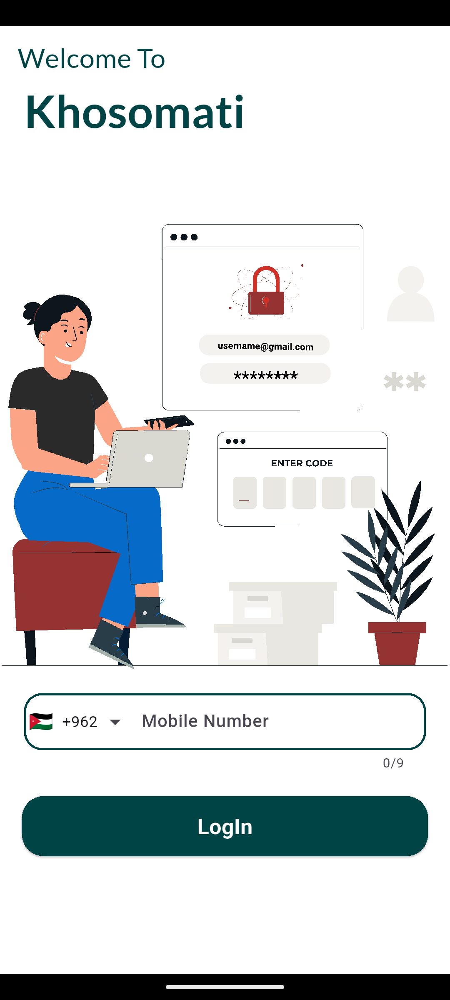
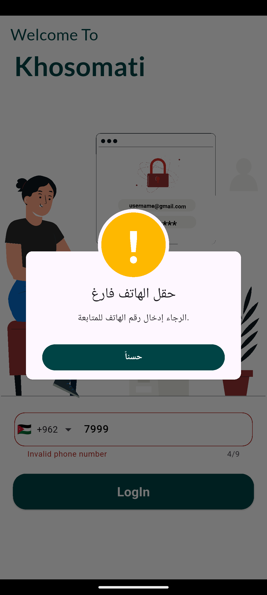
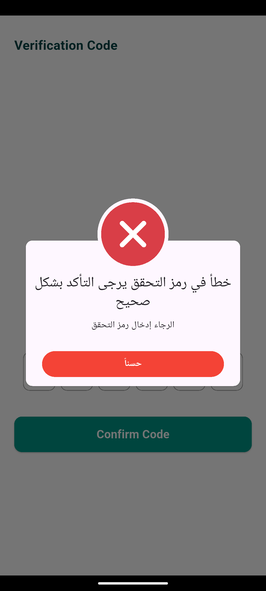
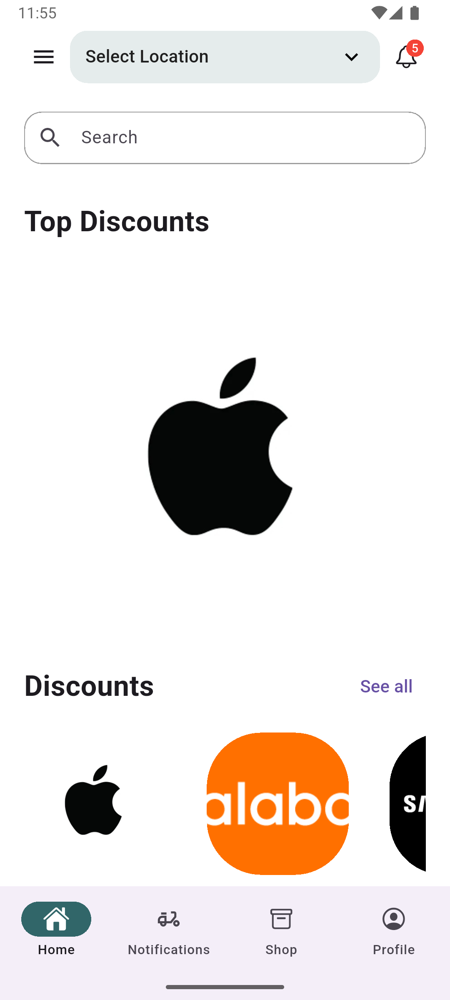
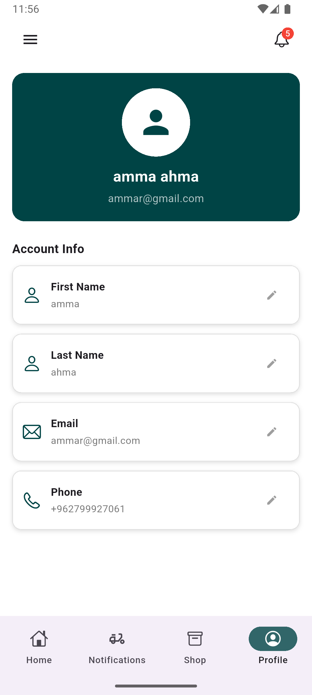
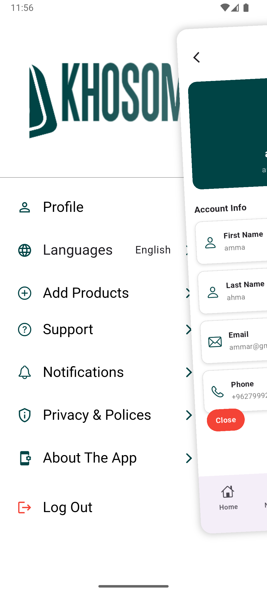
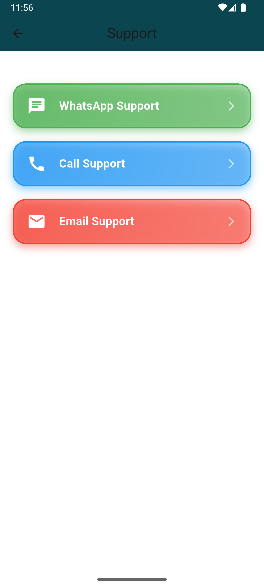
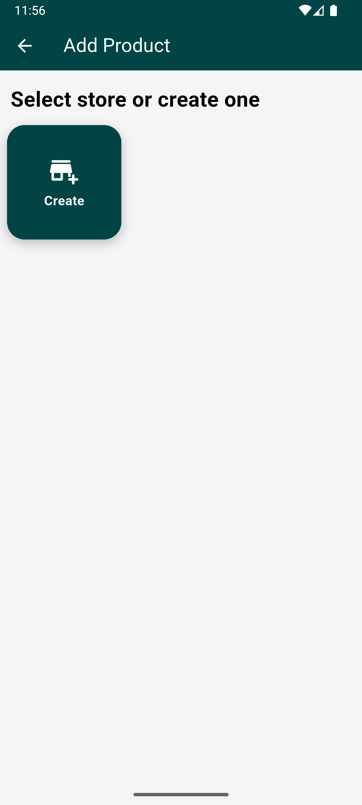
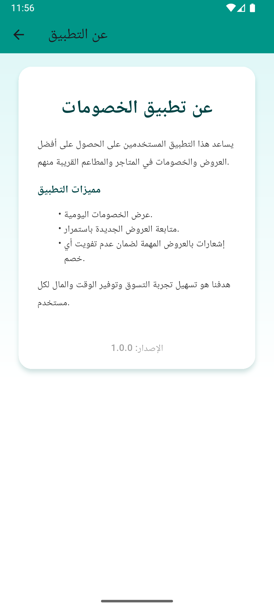
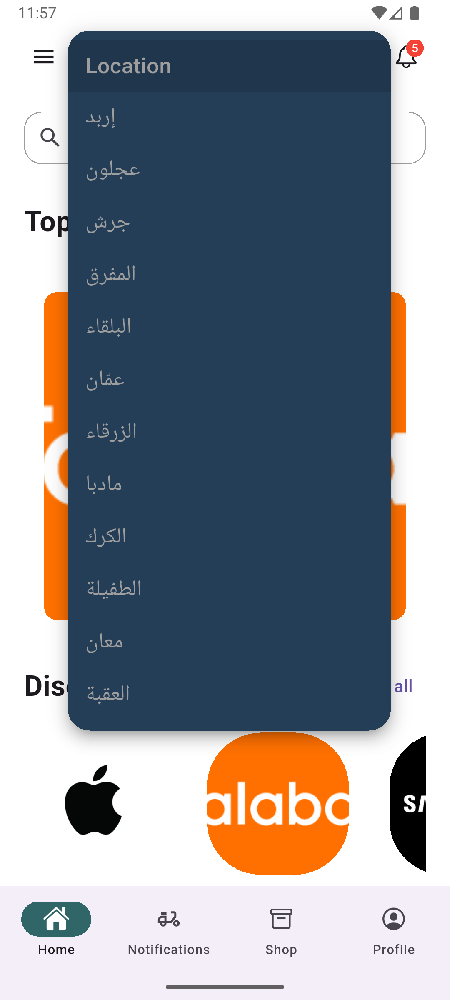

# 📱 Khsomati App — تطبيق خصوماتي

**Khsomati** هو تطبيق خصوماتي لعرض أفضل العروض والخصومات من المتاجر المختلفة،  
مع واجهة استخدام بسيطة، سلسة، وحديثة. التطبيق تم تطويره باستخدام **Flutter**  
واستخدمنا **Firebase services** مثل Authentication و Cloud Messaging و Firestore.  
تم العمل على المشروع كـ **Team** لتقسيم المهام بين واجهة المستخدم، الـ API، والخدمات الخلفية.

---

## 🌟 المميزات — Features

- 🔥 عرض الخصومات اليومية والعروض الحصرية
- 🏪 تصفّح المتاجر حسب الفئة أو المدينة
- ❤️ إضافة الخصومات للمفضلة
- 🔍 البحث عن العروض
- 🔔 استقبال إشعارات عند توفر خصومات جديدة
- 🌙 دعم الوضع الليلي
- 🚀 أداء سريع وتصميم واجهات احترافي

---

## 🖼️ صور التطبيق — Screenshots

> **`assets/screenshots/`**

### OnBoarding & Login Screens




### OTP & Other Screens




### Additional Screens






## 🛠️ التقنيات المستخدمة — Tech Stack

- **Flutter 3.x**  
- **Dart**  
- **Provider / Bloc**  
- **REST API Integration**  
- **Firebase Services**: Auth, Firestore, Cloud Messaging  
- **SharedPreferences / SQLite**  

## 📂 هيكل المشروع — Project Structure

```bash
lib/
 ├── business_logic/         # 🧠 إدارة المنطق والتطبيق (Business Logic)
 │    ├── providers/         # (أو blocs/) إدارة الحالة والتفاعلات
 │    └── services/          # خدمات التطبيق الداخلية (غير Firebase/API)
 ├── constants/              # ⚙️ الثوابت (الألوان، الخطوط، النصوص الثابتة، الأبعاد)
 ├── data/                   # 🗄️ طبقة البيانات (Data Layer)
 │    ├── models/            # تعريف نماذج البيانات (Models)
 │    ├── api/               # التعامل مع الـ REST API
 │    └── local_storage/     # إدارة التخزين المحلي
 ├── presentation/           # 🖥️ طبقة العرض (Presentation Layer)
 │    ├── screens/           # شاشات التطبيق الرئيسية
 │    ├── widgets/           # العناصر القابلة لإعادة الاستخدام في الشاشات
 │    └── components/        # مكونات الواجهة الأصغر
 ├── router/                 # 🗺️ نظام التوجيه (Routing & Navigation)
 ├── validators/             # 📝 أدوات التحقق من المدخلات (Input Checks)
 ├── firebase_options.dart   # إعدادات Firebase
 ├── notifications_mess.dart # إدارة إعدادات واستقبال الإشعارات (FCM)
 └── main.dart               # نقطة البداية وتشغيل التطبيق